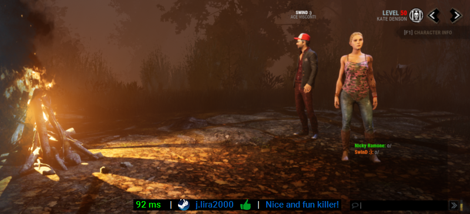

# What is LOOP?

LOOP (stands for "LObby simulatOr comPanion") is a tool for helping DBD ("Dead By Daylight") players have a better experience in the game,
especially while waiting in the match lobbies. It is strongly oriented towards survivor players.

LOOP can continuously show you the ping against the host you are connected to and can let you view the host's name,
 rate them as positive/negative or attach a description, so that next time you encounter them, you know what to expect.
This is especially useful because some hosts show a good ping on the lobby but then lag terribly during the match, or use
lag switch, which makes the game experience terrible.

Streamers might also find it especially useful to avoid harassment and excessive sniping, which they otherwise cannot control.

# What does it look like?
Here's a screenshot:

You can see the LOOP bar showing a ping of 92ms, and that I have previously positively rated this killer with a description of "Nice and fun killer!". 

# What are its features?
* Ping display: 
  * The ping against the lobby/match host will be displayed on the overlay.
* Rate the user that's hosting the lobby/match:
  * As soon as the host name is detected, hold Shift and click on the name. With every click, you will cycle between thumbs down, thumbs up and unrated.
  * This is stored so that next time you encounter them, you will see that information displayed.
* Attach a description to the lobby/match host:
  * As soon as the host name is detected, right-click on the overlay to add/edit a description.
  * This is stored so that next time you encounter them, you will see that information displayed.
* Visit the host's Steam profile:
  * As soon as the host name is detected, hold Shift and click on the Steam icon. It will attempt 
    to open the default browser on the host's Steam profile page.
* Re-position the overlay:
  * Double-click to lock/unlock the overlay for dragging.
  

## How does it work?
LOOP uses a packet capture library to detect STUN packets from any peer-to-peer connection in order to determine
who you're connected to and get ping from. It also uses an encrypted file for storing user-provided data.

# How to Install and Use?
**System Requirements:**
* Latest Java Runtime https://java.com/en/download/
* Npcap from https://nmap.org/npcap/ and tick "Install Npcap in WinPcap API-compatible Mode" during installation (For advanced users: Add %SystemRoot%\System32\Npcap\ to PATH instead.)

Simply double double click on the LOOP.jar file to run.

**NOTE:** You may need to right-click the JAR file, select Properties, and choose Unblock if it appears below Attributes.

**If UAC is enabled:** 
You may need to run the application via Command Prompt (this is due to the PCap4J library being unable to find devices).
* Copy the folder path that LOOP is in, for example: C:\Users\Dwight\Programs\LOOP\
* Right-click in the same directory as LOOP and create a new text document.
* Open it with Notepad and type, cd C:\The\Path\You\Copied\Earlier
* Start a new line with Enter and type, javaw -jar LOOP.jar
* Choose Save As and name it LOOP.bat with the option All Files selected
* Right-click the new batch file and Run as Administrator

# What's the current status?
We are in a Beta version 1.0.0, so be warned that there's a possibility that there might be some breaking changes soon.

## I am a killer main. Can I use it?
Well, you can, but you won't get much from it.
For now, this is oriented to survivors because it keeps track of a connection against the game host. 

## Can I get banned for using LOOP?
While I cannot provide a 100% guarantees on this, you shouldn't get banned for using it. Here's why:
1) This app does not modify or interact with DBD in any way.
2) It's a completely external/independent desktop application, which does not hook to any Steam/DBD process.
3) It only reads packets from P2P connections but never sends or fiddle with any packets.
4) It doesn't alter the game mechanics in any way so that you can gain in-game advantage.
5) It is based on the MLGA codebase, which has been approved by EAC, and running since 2016.
6) This tool will probably become obsolete once public servers are available.

Just in case, I have sent an email to EAC to see if we can get their approval. I am waiting for their reply.

## Why did you create this fork of MLGA (MakeLobbiesGreatAgain)?
LOOP has been built on the MLGA code, but I wanted to make significant changes to the codebase as well as the purpose of the project.
MLGA has become more of a generic P2P tool for multiple games, while LOOP is very oriented towards DBD survivor players.
Also, the core mechanics of identifying peers has changed, but we still use the MLGA implementation for detecting
STUN packets.

Finally, keep in mind that this project will become obsolete in several months, when the DBD public servers become available.

## Can I use MLGA and LOOP at the same time?
Yes. LOOP uses different configuration files than MLGA, so they don't collide.
