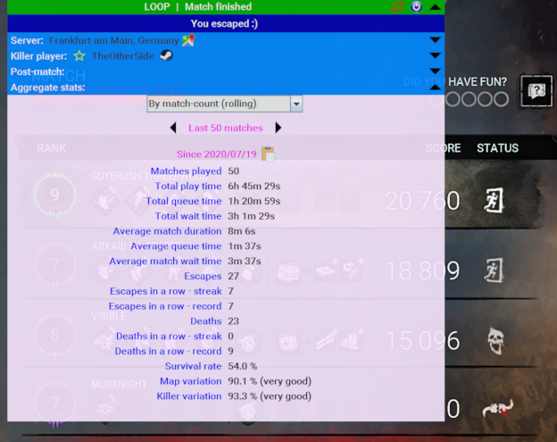

# What is LOOP?

LOOP (which comes from "LObby simulatOr comPanion") is a tool for giving "Dead By Daylight" (DBD) survivor players 
complementary information about the game, especially oriented towards personal statistics.

It can show you information about the server you are connecting to (such as its location), as well as 
about the killer player that you are facing (e.g., how many times you played against or how many times you escaped). 
It will even let you rate that player and add personal notes.
LOOP will also provide a bunch of statistics. Wonder how much time you spend on lobby queues vs. 
actually playing? or how many times you survived today, or this week, or during year, or the last 100 matches? 

# What does it look like?
Here's a sample screenshot:

You can see the LOOP bar showing the connection status, server information, killer information (in addition to your
own personal notes for rating them) and a bunch of statistics that include survival info match times, and queue times. 

# What are its main features?
  * Server information: show where the server you are connecting to is located.
  * Killer player information
    * Keeps track of how many times you played against them, how many times you escaped, died, etc.
    * Lets you rate this player as positive or negative and add personal notes. 
  * Post-match information: 
    * A summary of how long did the match last, how much time you spent in queue, etc.
    * A summary of who were the top runners of the team, with their respective chase times.
  * Aggregate stats:
    * Periodic stats: a daily (or weekly, or monthly, or yearly) summary of the matches.
    * Rolling stats: a summary of the last 50, 100, 250, 500 and 1000 matches.
    * Copy stats to the clipboard
  

# How to install?
1. Make sure you satisfy the system requirements:
    * Microsoft Windows (preferrably, Windows 10, which is what we test in)
    * Java Runtime of at least version 8 (https://java.com/en/download/)
1. Download loop.exe from the [releases page](https://github.com/nickyramone/LobbySimulatorCompanion/releases).
1. Create a folder where you would like to install this app (Example, under C:\Program Files\LobbySimulatorCompanion) 
   and place the exe there.
   * Tip: Don't throw it under the desktop. Instead, create a folder where to contain this application, and then create
          a desktop launcher if you want.

# How to run?
1. Double click on loop.exe on your installation folder.\
  **NOTE:** You may need to right-click on the file, select Properties, and choose "Unblock" if it appears below "Attributes".
1. If the application started successfully, you should see at least these two files in the installation directory:\
   loop.ini, loop.dat

# Is my data (like stats or personal notes) stored in / published to any servers?
No. We don't publish any data to any servers, which means that if you lose your installation folder 
(or format your hard disk), your data will be lost.
To prevent this, we recommend doing backups of the 'loop.dat' file.

## Can I get banned by EAC (Easy Anti Cheat) for using LOOP?
Short answer: No, as this is not a tool for cheating.

Long answer: While with these things you can never have a 100% guarantee because it's out of our control, here's why you shouldn't get banned:
1) This app does not modify or interfere with DBD in any way.
2) It is not aimed at cheating or gaining in-game advantage. It's oriented towards showing different kinds of stats.
3) It is a completely external/independent desktop application, which does not hook to any Steam/DBD process.
4) It doesn't alter the game mechanics in any way.
5) It is based on the MLGA codebase, which was not banned by EAC before.
6) The tool does nothing that you couldn't do manually. It just organizes and simplifies the information.
7) I have contacted EAC (Easy Anti Cheat) and they replied that it's not in their interest to ban these kinds of applications,
   unless explicitly asked by the game developers. Their "main focus is on the specifically crafted cheating tools".

## Why did you create this fork of MLGA (MakeLobbiesGreatAgain)?
LOOP has started being been built on top of the MLGA codebase, but I wanted to make significant changes to the codebase as well as the purpose of the project.
Also, at that time, MLGA had become more of a generic P2P tool for multiple games, while LOOP is very oriented towards DBD survivor players.
The code has changed so much with so many different features and design decisions that it has become a project of its own.

## Hey! My antivirus is giving me a warning about the exe file!
Some antivirus throw a false positive. This program is coded in Java, which is normally provided in jar format.
In order to distribute a more user-friendly format, the jar is wrapped in an exe bootsrapper, which is a technique
that sometimes trigger anti-virus false-positives.

## How can I contact the author?
You can send an email to: 
